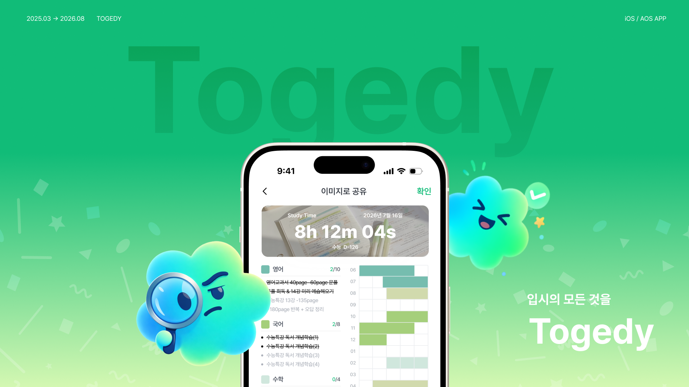
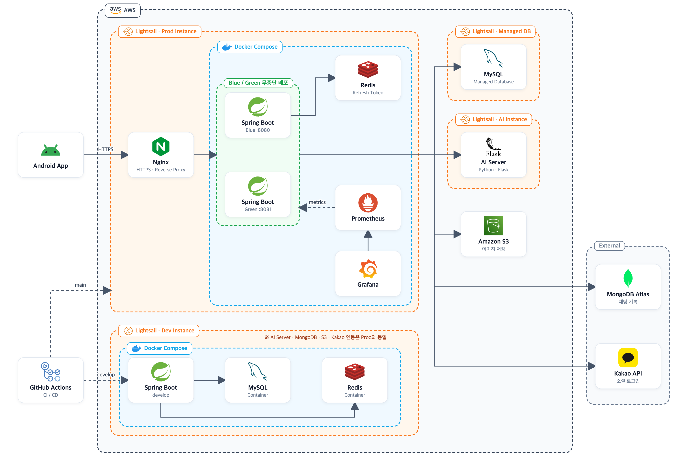
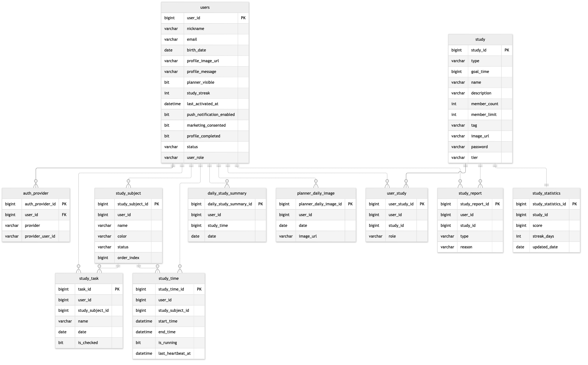
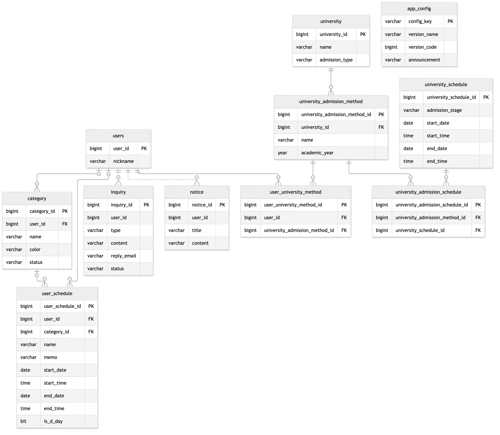

<h1 align="center">Togedy Server</h1>

<p align="center">
  공부 기록부터 입시 일정까지, 수험생의 하루를 함께하는 <b>Togedy</b> 서버
</p>

<p align="center">
  
  
  
  
  
  
  
</p>

---

## 📌 주요 기능

| 도메인                 | 기능                                                        |
|---------------------|-----------------------------------------------------------|
| **user**            | 카카오 소셜 로그인, JWT 인증/재발급, 온보딩, 닉네임 검증·추천, 회원 탈퇴             |
| **study**           | 스터디 생성·가입, 챌린지 스터디(목표 시간), 공부 중 멤버 조회, 스터디 통계·티어, 스터디 신고 |
| **planner**         | 과목·할 일 관리, 공부 타이머, 일간 타임테이블, 월간 공부시간 히트맵, 플래너 공유          |
| **university**      | 대학·전형 검색, 입시 일정 조회, 관심 전형 등록                              |
| **schedule**        | 개인 일정·카테고리 관리, 개인 + 대학 일정 통합 캘린더, D-Day                   |
| **chat**            | AI 서버 연동 입시 상담 챗봇                                         |
| **support**         | 공지사항(관리자 작성), 1:1 문의 접수·관리자 조회                              |
| **policy / config** | 약관·정책, 앱 설정                                               |

### 배치 작업

| 시각 (KST) | 작업          |
|----------|-------------|
| 1분 간격    | 하트비트가 끊긴 타이머 자동 종료 |
| 05:00    | 일간 공부 요약 집계 |
| 05:30    | 스터디 통계 집계   |
| 06:00    | 스터디 티어 갱신   |

---

## 🛠 기술 스택

| 분류                   | 기술                                                                                     |
|----------------------|----------------------------------------------------------------------------------------|
| Language / Framework | Java 17, Spring Boot 3.4, Spring Security, Spring Data JPA, Spring WebFlux (WebClient) |
| Database             | MySQL 8.0, Redis 7, MongoDB, Flyway                                                    |
| Auth                 | JWT, Kakao OAuth                                                                       |
| Infra                | AWS Lightsail, AWS S3, Docker, Nginx (Blue/Green)                                            |
| CI/CD                | GitHub Actions                                                                         |
| Monitoring           | Spring Actuator, Prometheus, Grafana                                                   |
| Test                 | JUnit 5, Mockito, Testcontainers, k6                                                   |
| Docs                 | Swagger (springdoc-openapi)                                                            |

---

## 🏗 시스템 아키텍처



- `develop` push → Dev 서버 자동 배포
- `main` push → Prod 서버 Blue/Green 무중단 배포
- Prometheus + Grafana 기반 애플리케이션 메트릭 모니터링
- 입시 상담 챗봇은 별도 AI 서버와 WebClient로 통신

---

## 🗂 ERD

> 실선: FK 관계 / 점선: FK 없이 ID로 참조하는 논리적 관계

### 유저 · 스터디 · 플래너



### 대학 · 일정 · 고객지원



<details>
<summary>도메인별 주요 엔티티</summary>

- **user** : `User`, `AuthProvider`
- **study** : `Study`, `UserStudy`, `StudyStatistics`, `StudyReport`
- **planner** : `StudySubject`, `StudyTask`, `StudyTime`, `DailyStudySummary`, `PlannerDailyImage`
- **university** : `University`, `UniversityAdmissionMethod`, `UniversityAdmissionSchedule`, `UniversitySchedule`,
  `UserUniversityMethod`
- **schedule** : `UserSchedule`, `Category`
- **chat** (MongoDB) : `ChatSession`, `ChatMessage`
- **support** : `Notice`, `Inquiry`
- **config** : `AppConfig`

</details>

---

## 📁 패키지 구조

```
com.togedy.togedy_server_v2
├── domain
│   ├── user · study · planner · university · schedule
│   ├── chat · support · policy · config
│   └── study             # 도메인 내부 구조 예시
│       ├── api           # Controller
│       ├── application   # Service
│       ├── dao           # Repository
│       ├── dto
│       ├── entity
│       ├── exception
│       ├── enums         # (선택) 도메인 전용 enum이 있을 때
│       ├── event         # (선택) 도메인 이벤트가 있을 때
│       └── scheduler     # (선택) 배치 작업이 있을 때
└── global
    ├── security          # JWT 인증/인가
    ├── config
    ├── infrastructure    # Kakao API 클라이언트
    ├── error · exception · handler · response
    ├── entity · enums · event · util
    └── service           # S3 업로드
```

> 모든 도메인은 `api` · `application` · `dto`를 기본으로 두고, 나머지 디렉터리는 필요한 경우에만 둡니다.
> (`policy`는 DB를 사용하지 않아 `dao` · `entity` · `exception`이 없습니다.)

```
infra
├── docker    # 환경별 docker-compose, Dockerfile, Prometheus 설정
├── nginx     # Blue/Green upstream 설정
├── script    # 배포 스크립트
└── k6        # 부하 테스트 스크립트
```

---

## 👥 팀원

| 이름  | GitHub                                   | 담당 기능                                                            |
|-----|------------------------------------------|------------------------------------------------------------------|
| 유혁  | [@You-Hyuk](https://github.com/You-Hyuk) | 스터디, 대학·입시 일정, 개인 일정·캘린더, AI 챗봇 연동, 고객지원·정책·앱 설정, 인프라·CI/CD·모니터링 |
| 김경민 | [@arkchive](https://github.com/arkchive) | 카카오 로그인·JWT, 온보딩·회원 관리, 플래너(과목·할 일·타이머·통계)                       |
